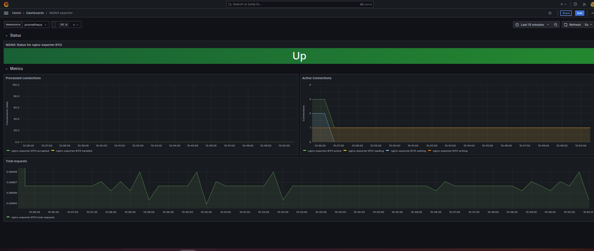

## Nginx Exporter

The Nginx Exporter is a tool that collects and exposes metrics from an Nginx server in a format compatible with Prometheus, a monitoring and alerting system. It provides insights into Nginx performance, like request rates, connections, and response times, enabling effective monitoring and analysis of Nginx instances

### Prerequisites

Enable the Nginx status

### Installation of Exporter

The docker-compose file will spin up the container for nginx-exporter and it also spin up a nginx pod.

### Dashboard

Use Dashboard -  ID 12708, This Dashobard is very usefule for begineer

